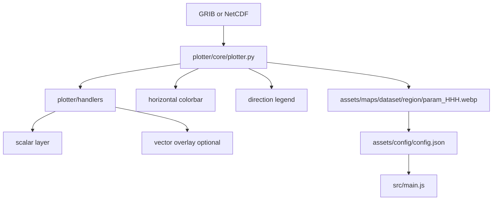

# Map Forecast Product Catalog

> Auto-generated by `scripts/generate_product_catalog.py`. Do not edit by hand.

Last updated: **2026-07-25 11:27 UTC**

## Progress summary

| Status | Count | Products |
|--------|-------|----------|
| **production** | 3 | `wind`, `swh`, `swell` |
| **ready** | 10 | `rainrate`, `temp`, `relhum`, `mslp`, `mslp_wind`, `rain_rh700`, `seatemp`, `seasalt`, `seacurrent`, `ssh` |
| **stub** | 0 | — |

- **Regions configured:** 9 (`malacca_strait, south_china_sea, philippines, andaman_gulf_thailand, java_nusa_tenggara, western_indo, eastern_indo, indonesia, southeast_asia`)
- **Datasets with deployed maps:** gfsatmos, gfswave, hycom

## Rendering pipeline



## Plot-type taxonomy

| Product | Scalar | Vector | Colorbar |
|---------|--------|--------|----------|
| `mslp` | contour | — | no |
| `mslp_wind` | none | windbarb | no |
| `rain_rh700` | contourf | — | yes |
| `rainrate` | contourf | — | yes |
| `relhum` | contourf | — | yes |
| `seacurrent` | contourf | quiver | yes |
| `seasalt` | contourf | — | yes |
| `seatemp` | contourf | — | yes |
| `ssh` | contourf | — | yes |
| `swell` | contourf | quiver | yes |
| `swh` | contourf | quiver | yes |
| `temp` | contourf | — | yes |
| `wind` | contourf | windbarb | yes |

### Plot methods

| Method | Matplotlib API | Use case |
|--------|----------------|----------|
| **Discrete shaded** | `contourf` or `pcolormesh` + `ListedColormap` + `BoundaryNorm` | All filled scalar products |
| **Line contour** | `contour` + `clabel` | MSLP isobars (no fill) |
| **Filled anomaly** | `contourf` + Nusawave diverging palette | SSH |
| **Vector overlay** | `quiver` or `barbs` | Wind/wave direction, sea current |

### Colorbar and legend

- Horizontal colorbar below the map (65% axes width), when `plot.colorbar.enabled` is true.
- Tick labels from `variables.*.levels` or implicit pcolormesh scale.
- Unit label in monospace to the right of the bar.
- Direction legend: quiver reference arrow, or windbarb convention note when `plot.vector.method: windbarb`.

## Product reference

### Production

| UI key | Slug | Display name | Dataset | Scalar | Vector | Colormap | Levels | Unit | Deployed |
|--------|------|--------------|---------|--------|--------|----------|--------|------|----------|
| `swell` | `swell` | Primary Swell Height and Direction | gfswave | contourf | quiver (overlay) | `nusawave_swell` (Nusawave) | 0–7 (14 bins) | meter | 9 region(s), F000, F001, F002, F003 |
| `swh` | `swh` | Significant Wave Height and Direction | gfswave | contourf | quiver (overlay) | `nusawave_wave` (Nusawave) | 0–7 (14 bins) | meter | 9 region(s), F000, F001, F002, F003 |
| `surface_wind` | `wind` | Surface Wind Speed and Direction | gfswave | contourf | windbarb (overlay) | `nusawave_wind` (Nusawave) | 0–60 (14 bins) | knots | 9 region(s), F000, F001, F002, F003 |

### Ready

| UI key | Slug | Display name | Dataset | Scalar | Vector | Colormap | Levels | Unit | Deployed |
|--------|------|--------------|---------|--------|--------|----------|--------|------|----------|
| `—` | `mslp` | Mean Sea Level Pressure | gfsatmos | contour | none | — | 980–1050 step 2 | hPa | not deployed |
| `mslp_wind` | `mslp_wind` | Surface Wind and MSLP | gfsatmos | none | windbarb (overlay) | — | — | knots | 9 region(s), F000, F001, F002, F003 |
| `rain_rh700` | `rain_rh700` | Rainfall Rate and 700 hPa Humidity | gfsatmos | contourf | none | `nusawave_rain` (Nusawave) | 0–20 (11 bins) | mm/hr | 9 region(s), F000, F001, F002, F003 |
| `—` | `rainrate` | Rainfall Rate | gfsatmos | contourf | none | `nusawave_rain` (Nusawave) | 0–20 (11 bins) | mm/hr | not deployed |
| `rh` | `relhum` | Surface Relative Humidity | gfsatmos | contourf | none | `nusawave_rh` (Nusawave) | 0–100 (11 bins) | % | 9 region(s), F000, F001, F002, F003 |
| `current` | `seacurrent` | Surface Sea Current and Direction | hycom | contourf | quiver (overlay) | `nusawave_current` (Nusawave) | 0–400 (13 bins) | cm/s | 9 region(s), F000, F001, F002, F003 |
| `sss` | `seasalt` | Surface Sea Salinity | hycom | contourf | none | `nusawave_salinity` (Nusawave) | 30–36 (13 bins) | PSU | 9 region(s), F000, F001, F002, F003 |
| `sst` | `seatemp` | Surface Sea Temperature | hycom | contourf | none | `nusawave_sst` (Nusawave) | 16–36 (20 bins) | degC | 9 region(s), F000, F001, F002, F003 |
| `ssh` | `ssh` | Sea Surface Height | cmems | contourf | none | `nusawave_ssh` (Nusawave) | -2–2 (17 bins) | meter | not deployed |
| `sfc_temp` | `temp` | Surface Air Temperature | gfsatmos | contourf | none | `nusawave_temp` (Nusawave) | 18–36 (19 bins) | degC | 9 region(s), F000, F001, F002, F003 |

## Nusawave colormap palettes

All shaded products use discrete palettes in [`plotter/core/colormaps.py`](../plotter/core/colormaps.py), anchored to brand colors `#0B2340` (navy) and `#0B74DE` (blue).

| Palette key | Products |
|-------------|----------|
| `nusawave_current` | `seacurrent` |
| `nusawave_rain` | `rainrate`, `rain_rh700` |
| `nusawave_rh` | `relhum` |
| `nusawave_salinity` | `seasalt` |
| `nusawave_ssh` | `ssh` |
| `nusawave_sst` | `seatemp` |
| `nusawave_swell` | `swell` |
| `nusawave_temp` | `temp` |
| `nusawave_wave` | `swh` |
| `nusawave_wind` | `wind` |

## Windbarb support

Wind products can opt in to windbarbs by setting in `plotter/config/config.yaml`:

```yaml
products:
  wind:
    plot:
      vector:
        method: windbarb
        overlay: true
```

Wave products (`swh`, `swell`) default to quiver overlays. `seacurrent` uses a filled speed field plus quiver direction.

## Configuration files

| File | Purpose |
|------|---------|
| [`plotter/config/config.yaml`](../plotter/config/config.yaml) | Product catalog, plot metadata, styling |
| [`assets/config/config.json`](../assets/config/config.json) | Frontend deployment catalog (from map scan) |
| [`plotter/handlers/`](../plotter/handlers/) | Per-product load/plot plugins |

